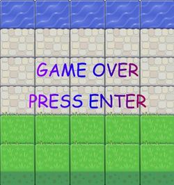

Frogger {frontend-nanodegree-arcade-game}
===============================
The classic 80's game **Frogger** restyled with human characters and enemies taken from many different videogames.

Documentation
===============================
Frogger is a Three-Level game where the player has to move a selected character through the screen from down to up using the keyboard direction arrows  trying to not hit the enemies because when he hits an enemies he loses points and consequently the lives. When the player reaches the top screen the game changes level, at the end of the third level when the player reaches the top the game is over and the player wins.

Download
===============================
`$ git clone https://github.com/svankj/frontend-nanodegree-arcade-game-final-project.git`

Usage
===============================
Just launch the web server, or similar, `SimpleHTTPServer` from terminal opened in the game directory. Then from a browser (e.g. `Chrome`) go to: `http://localhost:8000/index.html`

Frogger Guide
===============================
 `Screencaps` | `Notes`
--- | --- 
 | At the beginning you can choose between five characters selecting them with mouse (left click on the chosen one),
 | then it starts the game. The number at left up corner is the power of the player, the three hearts on the right up corner are the lives. When after hitting an enemy the power arrives to zero one life is lost, till you have a life you can play.
 | When you reach the top you pass to next level.
 | From second level there are the bonuses. The good bonus increases, if you take it, the player power, the bad one decreases the player power.
 | Game Over Screen
 | Winner Screen

License
===============================
>MIT License

>Copyright (c) 2016 svankj

>Permission is hereby granted, free of charge, to any person obtaining a copy
of this software and associated documentation files (the "Software"), to deal
in the Software without restriction, including without limitation the rights
to use, copy, modify, merge, publish, distribute, sublicense, and/or sell
copies of the Software, and to permit persons to whom the Software is
furnished to do so, subject to the following conditions:

>The above copyright notice and this permission notice shall be included in all
copies or substantial portions of the Software.

>THE SOFTWARE IS PROVIDED "AS IS", WITHOUT WARRANTY OF ANY KIND, EXPRESS OR
IMPLIED, INCLUDING BUT NOT LIMITED TO THE WARRANTIES OF MERCHANTABILITY,
FITNESS FOR A PARTICULAR PURPOSE AND NONINFRINGEMENT. IN NO EVENT SHALL THE
AUTHORS OR COPYRIGHT HOLDERS BE LIABLE FOR ANY CLAIM, DAMAGES OR OTHER
LIABILITY, WHETHER IN AN ACTION OF CONTRACT, TORT OR OTHERWISE, ARISING FROM,
OUT OF OR IN CONNECTION WITH THE SOFTWARE OR THE USE OR OTHER DEALINGS IN THE
SOFTWARE.

About me
===============================
 | `svanky is a Freelance Developer`
--- | --- 